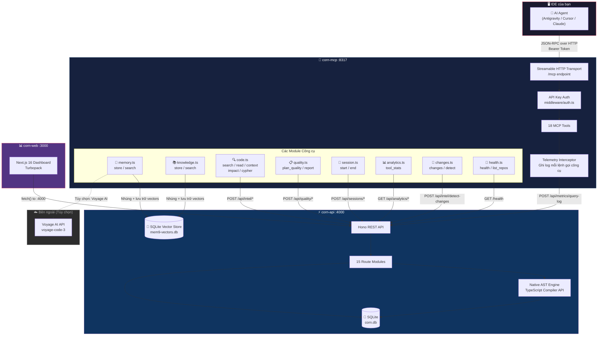
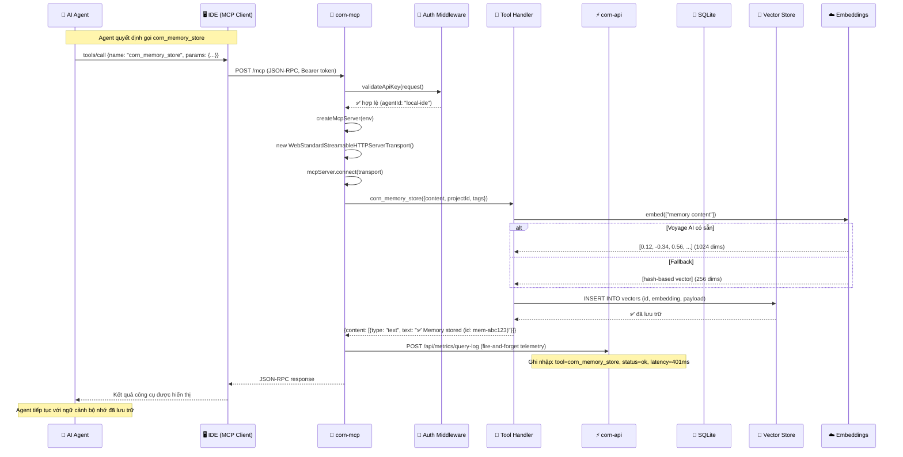
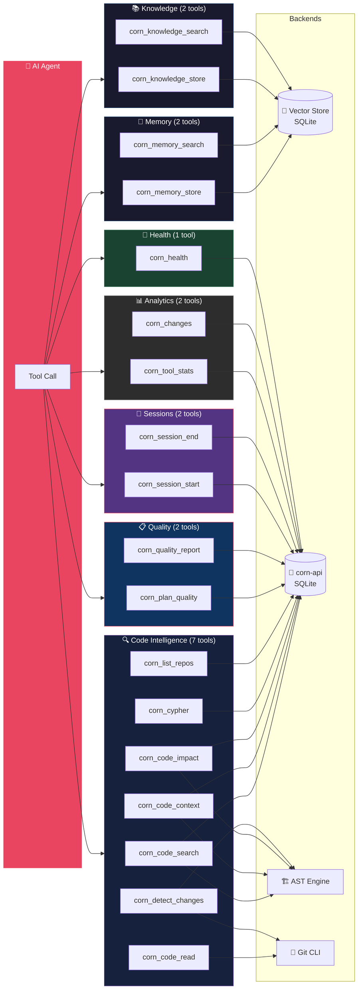
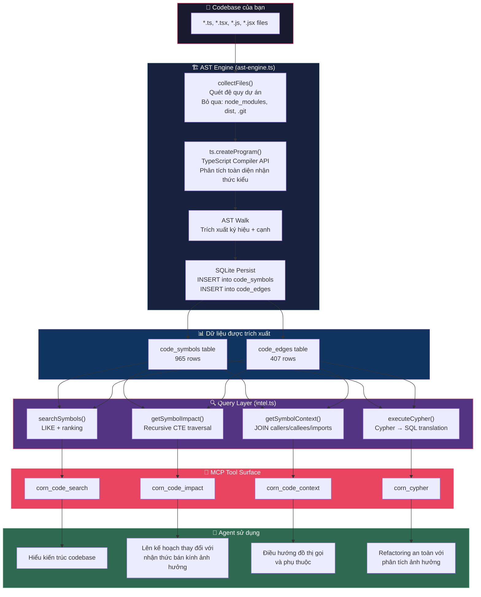

# 🌽 CornMCP

**Nền tảng AI Agent Intelligence — MCP Server + Bảng điều khiển Analytics**

> Trí thông minh mã hóa chính xác. Bộ nhớ ngữ nghĩa. Thực thi kiểm soát chất lượng.
> Ngừng lãng phí token trên việc đọc toàn bộ tệp. Bắt đầu trích xuất chính xác những gì agent của bạn cần.

[](https://nodejs.org)
[](https://typescriptlang.org)
[](https://modelcontextprotocol.io)
[](LICENSE)

---

## CornMCP là gì?

Corn Hub là một **máy chủ Model Context Protocol (MCP)** và **bảng điều khiển analytics thời gian thực** cung cấp cho các agent mã hóa AI (Antigravity, Cursor, Claude Code, Codex) quyền truy cập chính xác vào codebase của bạn.

Thay vì đổ toàn bộ tệp vào cửa sổ ngữ cảnh, CornMCP cung cấp:

- 🧠 **Bộ nhớ ngữ nghĩa** — Agent ghi nhớ qua các phiên làm việc thông qua tìm kiếm vector
- 🔍 **Công cụ AST tự nhiên** — Biểu đồ gọi thực, hệ thống phân cấp kiểu, phân tích mức ký hiệu qua TypeScript Compiler API
- 📋 **Cổng chất lượng** — Kế hoạch phải đạt điểm ≥80% trước khi thực thi
- 📊 **Analytics trực tiếp** — Theo dõi mọi lệnh gọi công cụ, độ trễ và tiết kiệm token
- 🔄 **Nhận thức đa Agent** — Agent thấy các thay đổi của nhau theo thời gian thực
- 💾 **Không phụ thuộc bên ngoài** — Không có dịch vụ bên ngoài. Tất cả chạy cục bộ với SQLite.

---

## Kiến trúc

### 1. Tổng quan hệ thống

> Cách ba dịch vụ kết nối và liên lạc với nhau.



#### Cách thức hoạt động

| Kết nối | Giao thức | Mô tả |
|-----------|----------|------|
| **IDE → corn-mcp** | JSON-RPC over HTTP | Agent AI gửi lệnh gọi công cụ qua SDK MCP. Yêu cầu xác thực Bearer token. |
| **corn-mcp → corn-api** | REST HTTP (fetch) | Trình xử lý công cụ gọi các endpoint API Dashboard để lưu trữ dữ liệu. |
| **corn-mcp → SQLite vectors** | Direct file I/O | Các công cụ memory và knowledge nhúng nội dung và lưu trữ vectors cục bộ. |
| **corn-mcp → Voyage AI** | HTTPS API | Tùy chọn: nhúng ngữ nghĩa để tìm kiếm memory/knowledge. Quay lại hash cục bộ nếu không có. |
| **corn-api → SQLite** | sql.js (in-process) | Tất cả dữ liệu được lưu trữ trong `./data/corn.db` — phiên, chất lượng, đồ thị mã, analytics. |
| **corn-web → corn-api** | REST HTTP (fetch) | Dashboard lấy dữ liệu từ API `:4000` để trực quan hóa thời gian thực. |
| **Telemetry** | Fire-and-forget POST | Mỗi lệnh gọi công cụ được ghi nhập `/api/metrics/query-log` cho bảng điều khiển analytics. |

---

### 2. Vòng đời yêu cầu MCP

> Điều gì xảy ra từng bước khi agent AI gọi một công cụ Corn Hub.



#### Chi tiết chính

- **Stateless**: Mỗi yêu cầu tạo một phiên bản `McpServer` mới — không có trạng thái phiên trên máy chủ
- **Xác thực**: Bearer token được xác nhận với các khóa API được lưu trữ trong cơ sở dữ liệu `corn-api`
- **Telemetry**: Mỗi lệnh gọi công cụ được ghi nhập (tên công cụ, trạng thái, độ trễ, kích thước đầu vào) dưới dạng fire-and-forget
- **Nhúng Fallback**: Nếu Voyage AI bị giới hạn tốc độ hoặc không có sẵn, tự động xoay các mô hình sau đó quay lại nhúng hash cục bộ
- **Xoay mô hình**: `voyage-code-3` → `voyage-4-large` → `voyage-4` → `voyage-code-2` → `voyage-4-lite`

---

### 3. 18 Công cụ MCP — Danh mục & Luồng dữ liệu

> Mỗi công cụ được nhóm theo danh mục, cho thấy backend nào mà mỗi công cụ sử dụng.



#### Tham chiếu công cụ

| # | Công cụ | Danh mục | Backend | Mô tả |
|---|---------|----------|---------|------|
| 1 | `corn_health` | Health | API | Sức khỏe hệ thống — các dịch vụ, uptime, phiên bản |
| 2 | `corn_list_repos` | Code | API + AST | Danh sách kho lưu trữ được lập chỉ mục với số lượng ký hiệu |
| 3 | `corn_code_search` | Code | AST → SQLite | Tìm kiếm ký hiệu hybrid vector/AST |
| 4 | `corn_code_read` | Code | Filesystem | Đọc mã nguồn thô từ các kho được lập chỉ mục với các dòng |
| 5 | `corn_code_context` | Code | AST → SQLite | Chế độ xem ký hiệu 360°: callers, callees, phân cấp |
| 6 | `corn_code_impact` | Code | AST → SQLite | Phân tích bán kính ảnh hưởng với CTE đệ quy |
| 7 | `corn_cypher` | Code | AST → SQLite | Truy vấn giống Cypher được dịch sang SQL |
| 8 | `corn_detect_changes` | Code | Git + AST | Phân tích các thay đổi chưa được cam kết với tham chiếu đồ thị |
| 9 | `corn_memory_store` | Memory | Vector DB | Lưu trữ bộ nhớ agent với nhúng |
| 10 | `corn_memory_search` | Memory | Vector DB | Tìm kiếm tương tự ngữ nghĩa trên các bộ nhớ |
| 11 | `corn_knowledge_store` | Knowledge | Vector DB | Lưu trữ mục kiến thức chung |
| 12 | `corn_knowledge_search` | Knowledge | Vector DB | Tìm kiếm ngữ nghĩa trên cơ sở kiến thức |
| 13 | `corn_plan_quality` | Quality | API SQLite | Chấm điểm kế hoạch theo 8 tiêu chí (phải ≥80%) |
| 14 | `corn_quality_report` | Quality | API SQLite | Gửi báo cáo chất lượng 4 chiều (phải ≥80%) |
| 15 | `corn_session_start` | Session | API SQLite | Bắt đầu phiên làm việc được theo dõi |
| 16 | `corn_session_end` | Session | API SQLite | Kết thúc phiên với tóm tắt và quyết định |
| 17 | `corn_tool_stats` | Analytics | API SQLite | Xem analytics sử dụng công cụ và xu hướng |
| 18 | `corn_changes` | Analytics | API SQLite | Kiểm tra các cam kết gần đây từ các agent khác |

---

### 4. Luồng dữ liệu — Từ mã đến thông minh

> Cách codebase của bạn trở thành biểu đồ kiến thức có thể truy vấn.



#### Chi tiết trích xuất ký hiệu

| Loại ký hiệu | Ví dụ | Những gì được nắm bắt |
|-------------|--------|----------------------|
| **Function** | `createLogger()` | Tên, params, kiểu trả về, tệp, dòng, được xuất?, chữ ký |
| **Class** | `CornError` | Tên, extends, implements, phương thức, thuộc tính |
| **Interface** | `Logger` | Tên, thành viên, extends |
| **Type** | `LogLevel` | Tên, định nghĩa |
| **Enum** | `HttpStatus` | Tên, thành viên |
| **Variable** | `app` | Tên, chú thích kiểu, initializer |

#### Loại cạnh

| Cạnh | Ý nghĩa | Ví dụ |
|-----|---------|-------|
| `calls` | Hàm A gọi hàm B | `start()` → `getDb()` |
| `imports` | Tệp A nhập từ tệp B | `index.ts` → `@corn/shared-utils` |
| `extends` | Lớp A mở rộng lớp B | `NotFoundError` → `CornError` |
| `implements` | Lớp thực hiện Interface | `LocalHashEmbeddingProvider` → `EmbeddingProvider` |

> **Hiệu năng**: Corn Hub lập chỉ mục chính nó (49 tệp) trong ~2 giây, trích xuất 965 ký hiệu và 407 cạnh.

---

## Cấu trúc dự án

```
corn-hub/
├── apps/
│   ├── corn-api/              # Dashboard REST API (Hono + SQLite)
│   │   └── src/
│   │       ├── index.ts       # Server entry, health checks
│   │       ├── db/
│   │       │   ├── client.ts  # SQLite client (sql.js)
│   │       │   └── schema.sql # Database schema (code_symbols, code_edges, etc.)
│   │       ├── services/
│   │       │   └── ast-engine.ts  # 🆕 Native TypeScript Compiler API AST engine
│   │       └── routes/
│   │           ├── intel.ts      # Code intelligence (search, context, impact, cypher)
│   │           ├── indexing.ts   # Trigger AST analysis for projects
│   │           ├── analytics.ts  # Tool usage analytics
│   │           ├── knowledge.ts  # Knowledge base CRUD
│   │           ├── projects.ts   # Project management
│   │           ├── providers.ts  # LLM provider accounts
│   │           ├── quality.ts    # 4D quality reports
│   │           ├── sessions.ts   # Agent session tracking
│   │           ├── setup.ts      # System info
│   │           ├── stats.ts      # Dashboard metrics
│   │           ├── system.ts     # System metrics (CPU, memory)
│   │           ├── usage.ts      # Token usage tracking
│   │           └── webhooks.ts   # Webhook endpoints
│   │
│   ├── corn-mcp/              # MCP Server (18 tools)
│   │   └── src/
│   │       ├── cli.ts         # STDIO transport + telemetry interceptor
│   │       ├── index.ts       # Server factory + tool registration
│   │       ├── node.ts        # HTTP transport entry point
│   │       └── tools/
│   │           ├── analytics.ts   # corn_tool_stats
│   │           ├── changes.ts     # corn_changes, corn_detect_changes
│   │           ├── code.ts        # corn_code_search/read/context/impact, corn_cypher
│   │           ├── health.ts      # corn_health
│   │           ├── knowledge.ts   # corn_knowledge_search/store
│   │           ├── memory.ts      # corn_memory_search/store
│   │           ├── quality.ts     # corn_plan_quality, corn_quality_report
│   │           └── sessions.ts    # corn_session_start/end
│   │
│   └── corn-web/              # Analytics Dashboard (Next.js 16)
│       └── src/
│           ├── app/
│           │   ├── page.tsx       # Main dashboard
│           │   ├── quality/       # Quality reports & grade trends
│           │   ├── sessions/      # Agent session history
│           │   ├── usage/         # Token usage analytics
│           │   ├── knowledge/     # Knowledge base viewer
│           │   ├── projects/      # Project management
│           │   ├── installation/  # IDE setup guide
│           │   └── settings/      # Configuration
│           ├── components/
│           │   └── layout/        # Glassmorphic dashboard shell
│           └── lib/
│               └── api.ts         # API client
│
├── packages/
│   ├── shared-mem9/           # Vector DB + Embedding Provider
│   │   └── src/index.ts       # SQLite vector store, model rotation,
│   │                          # OpenAI/Voyage embeddings, hash fallback
│   ├── shared-types/          # Shared TypeScript interfaces
│   └── shared-utils/          # Logger, ID gen, error classes
│
├── infra/
│   ├── docker-compose.yml     # Optional Docker stack
│   ├── Dockerfile.corn-api
│   ├── Dockerfile.corn-mcp
│   ├── Dockerfile.corn-web
│   └── nginx-dashboard.conf
│
└── .agent/
    └── workflows/
        └── corn-quality-gates.md  # Mandatory AI quality workflow
```

---

## Công cụ AST tự nhiên

Corn Hub bao gồm một **công cụ TypeScript Compiler API được xây dựng sẵn** cung cấp trí thông minh mã thực — không cần dịch vụ bên ngoài.

### Những gì nó trích xuất

| Danh mục | Chi tiết |
|---------|---------|
| **Ký hiệu** | Hàm, lớp, interfaces, kiểu, enums, biến, phương thức, thuộc tính |
| **Cạnh** | Gọi hàm, imports, extends, implements |
| **Metadata** | Đường dẫn tệp, dãy dòng, trạng thái xuất, chữ ký, bình luận JSDoc |

### Cách thức hoạt động

```
Thư mục dự án cục bộ
        │
        ▼
  collectFiles()          Tìm đệ quy tất cả các tệp .ts/.tsx/.js/.jsx
        │                 (bỏ qua node_modules, dist, .git, etc.)
        ▼
  ts.createProgram()      TypeScript Compiler API phân tích tất cả tệp
        │
        ▼
  AST Walk                Trích xuất ký hiệu + xây dựng cạnh phụ thuộc
        │
        ▼
  SQLite Storage          INSERT into code_symbols + code_edges tables
        │
        ▼
  Query Functions         searchSymbols, getSymbolContext, getSymbolImpact,
                          executeCypher, getProjectStats
```

### Khả năng

- **Biểu đồ gọi**: Ai gọi `dbRun`? → 8 người gọi trên 5 tệp với số dòng chính xác
- **Phân tích ảnh hưởng**: Điều gì bị phá vỡ nếu tôi thay đổi `createLogger`? → CTE đệ quy theo dõi 6 ký hiệu hạ lưu
- **Truy vấn Cypher**: `MATCH (n:class) RETURN n` → Tìm tất cả 10 lớp trong codebase
- **Ánh xạ nhập**: Những tệp nào nhập từ `shared-utils`? → Biểu đồ phụ thuộc đầy đủ
- **Phân cấp kiểu**: `CornError` → `NotFoundError`, `UnauthorizedError`, `ValidationError`

### Kết quả tự lập chỉ mục (Corn Hub chính nó)

| Chỉ số | Giá trị |
|-------|-------:|
| Tệp được phân tích | 49 |
| Ký hiệu được trích xuất | 965 |
| Cạnh được xây dựng | 407 |
| Theo loại | 764 biến, 111 hàm, 32 interfaces, 28 phương thức, 16 thuộc tính, 10 lớp, 1 kiểu |
| Thời gian phân tích | ~2 giây |

---

## Tham chiếu công cụ MCP

Corn Hub công khai **18 công cụ** qua Model Context Protocol:

### 🧠 Bộ nhớ và kiến thức

| Công cụ | Mô tả |
|---------|------|
| `corn_memory_store` | Lưu trữ bộ nhớ để gọi lại qua phiên |
| `corn_memory_search` | Tìm kiếm ngữ nghĩa trên tất cả bộ nhớ agent |
| `corn_knowledge_store` | Lưu các mẫu, quyết định, sửa lỗi có thể tái sử dụng |
| `corn_knowledge_search` | Tìm kiếm cơ sở kiến thức chung |

### 🔍 Trí thông minh mã (Được cung cấp bởi AST)

| Công cụ | Mô tả |
|---------|------|
| `corn_code_search` | Tìm kiếm hybrid vector + AST trên codebase |
| `corn_code_read` | Đọc mã nguồn thô từ các kho được lập chỉ mục với dãy dòng |
| `corn_code_context` | Chế độ xem 360° của ký hiệu: callers, callees, imports, phân cấp |
| `corn_code_impact` | Phân tích bán kính ảnh hưởng — CTE đệ quy trên các cạnh phụ thuộc |
| `corn_cypher` | Truy vấn giống Cypher được dịch sang SQL trên biểu đồ mã |
| `corn_detect_changes` | Phân tích các thay đổi chưa được cam kết + tham chiếu chéo với ký hiệu được lập chỉ mục |
| `corn_list_repos` | Danh sách tất cả các kho được lập chỉ mục với số lượng ký hiệu/cạnh |

### 📋 Chất lượng và phiên

| Công cụ | Mô tả |
|---------|------|
| `corn_plan_quality` | Chấm điểm kế hoạch theo 8 tiêu chí (phải qua ≥80%) |
| `corn_quality_report` | Gửi điểm chất lượng 4D (Build, Regression, Standards, Traceability) |
| `corn_session_start` | Bắt đầu phiên làm việc được theo dõi |
| `corn_session_end` | Kết thúc phiên với tóm tắt, tệp được thay đổi, quyết định |
| `corn_changes` | Kiểm tra các thay đổi gần đây từ các agent khác |

### 📊 Analytics và hệ thống

| Công cụ | Mô tả |
|---------|------|
| `corn_tool_stats` | Xem analytics sử dụng công cụ, tỷ lệ thành công, độ trễ |
| `corn_health` | Kiểm tra sức khỏe hệ thống — tất cả dịch vụ, trạng thái nhúng |

---

## Quy trình chất lượng bắt buộc

Mỗi tác vụ tuân theo quy trình được thực thi:

```
┌──────────────┐     ┌──────────────┐     ┌──────────────┐
│  PHASE 0     │────▶│  PHASE 1     │────▶│  PHASE 2     │
│  Session     │     │  Planning    │     │  Execution   │
│  Start       │     │              │     │              │
│              │     │  Plan must   │     │  Build &     │
│ • tool_stats │     │  score ≥80%  │     │  implement   │
│ • changes    │     │  or REJECTED │     │              │
│ • memory     │     │              │     │              │
└──────────────┘     └──────────────┘     └──────┬───────┘
                                                  │
┌──────────────┐     ┌──────────────┐             │
│  PHASE 4     │◀────│  PHASE 3     │◀────────────┘
│  Session     │     │  Quality     │
│  End         │     │  Report      │
│              │     │              │
│ • knowledge  │     │  Score must  │
│ • memory     │     │  be ≥80/100  │
│ • end        │     │  or FAIL     │
│ • stats      │     │              │
└──────────────┘     └──────────────┘
```

Cấu hình trong `.agent/workflows/corn-quality-gates.md`.

---

## Cài đặt

### Trình cài đặt một lệnh (Được khuyến nghị)

```bash
npx corn-install
```

Trình cài đặt tương tác sẽ:
1. Kiểm tra Docker, Node.js, Git, pnpm
2. Cài đặt các phụ thuộc bị thiếu (với sự cho phép của bạn)
3. Sao chép kho Corn Hub
4. Cấu hình khóa API Voyage AI để nhúng
5. Xây dựng và khởi động ngăn xếp Docker
6. Cấu hình IDE của bạn (Antigravity, Claude Code, Cursor, VS Code, Codex, Windsurf)
7. Xác minh tất cả 18 công cụ MCP đang hoạt động

Sau khi cài đặt, chạy **bảng điều khiển theo dõi trực tiếp**:

```bash
npx corn-install monitor
```

### Điều kiện tiên quyết
- **Node.js** 22+
- **pnpm** 10+
- **Docker** (bắt buộc để chạy ngăn xếp đầy đủ)

### Bắt đầu nhanh (Thủ công)

```bash
# Clone
git clone https://github.com/yuki-20/corn-hub.git
cd corn-hub

# Install dependencies
pnpm install

# Start the API backend
cd apps/corn-api && npx tsx src/index.ts

# In another terminal — start the MCP server (HTTP mode)
cd apps/corn-mcp && npx tsx src/node.ts

# In another terminal — start the dashboard
cd apps/corn-web && npx next dev
```

| Dịch vụ | Cổng | Mô tả |
|--------|------|------|
| **corn-api** | `:4000` | Hono REST API + SQLite + AST Engine |
| **corn-mcp** | `:8317` | MCP Gateway (HTTP transport) |
| **corn-web** | `:3000` | Next.js Dashboard |

### Cấu hình IDE

> ⚠️ **Thay thế đường dẫn dưới đây** bằng nơi BẠN đã sao chép corn-hub.

#### Antigravity / Codex (VS Code)

```json
{
  "mcpServers": {
    "corn": {
      "command": "node",
      "args": ["/path/to/corn-hub/apps/corn-mcp/dist/cli.js"]
    }
  }
}
```

#### Cursor

1. **Settings** → **Features** → **MCP**
2. Bấm **+ Add new MCP server**
3. **Name**: `corn` · **Type**: `command`
4. **Command**: `node /path/to/corn-hub/apps/corn-mcp/dist/cli.js`

#### Claude Code

```bash
claude mcp add corn -- node /path/to/corn-hub/apps/corn-mcp/dist/cli.js
```

| HĐH | Ví dụ đường dẫn |
|-----|----------------|
| Windows | `C:\Users\You\corn-hub\apps\corn-mcp\dist\cli.js` |
| macOS | `/Users/You/corn-hub/apps/corn-mcp/dist/cli.js` |
| Linux | `/home/You/corn-hub/apps/corn-mcp/dist/cli.js` |

### Lập chỉ mục dự án của bạn

Sau khi API chạy, tạo dự án và lập chỉ mục:

```bash
# Create a project pointing to your local repo
curl -X POST http://localhost:4000/api/projects \
  -H "Content-Type: application/json" \
  -d '{"name":"My Project","gitRepoUrl":"/path/to/your/repo"}'

# Trigger AST analysis (returns projectId from above)
curl -X POST http://localhost:4000/api/intel/analyze \
  -H "Content-Type: application/json" \
  -d '{"projectId":"proj-XXXXX"}'
```

---

## Bảng điều khiển (Docker tùy chọn)

```bash
docker compose -f infra/docker-compose.yml up -d --build
```

Mở **http://localhost:3000** → bảng điều khiển Corn Hub Analytics.

> **Lưu ý:** Docker là tùy chọn. Tất cả dịch vụ chạy cục bộ với Node.js để phát triển.

---

## Biến môi trường

| Biến | Mặc định | Mô tả |
|------|---------|------|
| `OPENAI_API_KEY` | — | Khóa API Voyage AI / OpenAI để nhúng |
| `OPENAI_API_BASE` | `https://api.voyageai.com/v1` | URL cơ sở API nhúng |
| `MEM9_EMBEDDING_MODEL` | `voyage-code-3` | Mô hình nhúng chính |
| `MEM9_EMBEDDING_DIMS` | `1024` | Kích thước nhúng |
| `MEM9_FALLBACK_MODELS` | `voyage-4-large,voyage-4,voyage-code-2,voyage-4-lite` | Chuỗi xoay mô hình fallback |
| `DASHBOARD_API_URL` | `http://localhost:4000` | URL API bảng điều khiển |

### Xoay mô hình

Khi mô hình chính bị giới hạn tốc độ (429), Corn Hub tự động xoay qua các mô hình fallback:

```
voyage-code-3 → voyage-4-large → voyage-4 → voyage-code-2 → voyage-4-lite
 (mã tốt nhất)   (gen lớn nhất)  (gen-4)    (mã cũ hơn)     (nhẹ)
```

Mỗi mô hình được thử lại 3 lần với backoff theo cấp số nhân trước khi xoay. Đặt `MEM9_FALLBACK_MODELS` để tùy chỉnh.

---

## Tiết kiệm token thực (Dữ liệu được đo lường)

> Những con số này từ việc sử dụng thực tế, không phải dự báo lý thuyết.

Trong một phiên trực tiếp 29 lệnh gọi trên codebase Corn Hub (55 tệp, 217 KB):

| Chỉ số | Giá trị |
|-------|-------:|
| Trung bình token cho mỗi lệnh gọi công cụ | **137 token** |
| Trung bình token cho mỗi lần đọc tệp (tiêu chuẩn) | **~1,500 token** |
| Chi phí lệnh gọi công cụ (29 lệnh) | 3,966 token |
| Số lần đọc tệp được ngăn chặn | ~34,600 token tiết kiệm |

### Tiết kiệm theo kích thước codebase

| Kích thước kho | Agent tiêu chuẩn | Với Corn Hub | Tiết kiệm |
|----------------|----------------:|------------:|--------:|
| Nhỏ (55 tệp) | ~195K token | ~135K token | **30%** |
| Trung bình (200 tệp) | ~450K token | ~180K token | **60%** |
| Lớn (1000 tệp) | ~1.2M token | ~250K token | **79%** |
| Enterprise (5000+) | ~3M+ token | ~400K token | **87%** |

> Tìm kiếm ngữ nghĩa của Corn Hub là O(1) — nó trả về ~137 token bất kể kích thước codebase.

---

## Khắc phục sự cố

**`Error: Cannot find module '.../dist/cli.js'`**
- Chạy `pnpm build` trước — thư mục `dist/` được tạo bởi bước xây dựng
- Kiểm tra đường dẫn trỏ đến bản sao cục bộ của BẠN
- Trên Windows, sử dụng dấu gạch chéo hoặc dấu gạch chéo thoát trong cấu hình JSON

**`429 Too Many Requests` từ Voyage AI**
- Tầng miễn phí: 3 RPM, 10K TPM. Corn Hub tự động thử lại với backoff và xoay mô hình
- Thêm phương thức thanh toán tại [dashboard.voyageai.com](https://dashboard.voyageai.com) để có giới hạn cao hơn

**Bảng điều khiển hiển thị 0 agent / 0 truy vấn**
- Khởi động lại IDE để tải lại máy chủ MCP với trình chặn telemetry mới nhất
- Đảm bảo `corn-api` chạy trên cổng 4000

**Lỗi STDIO `invalid character '\x1b'`**
- Corn Hub vá `console.log` để chuyển hướng đến stderr. Nếu một phụ thuộc bỏ qua điều này, hãy kiểm tra đầu ra màu ANSI bị rò rỉ vào stdout.

**Trí thông minh mã trả về kết quả trống**
- Đảm bảo dự án của bạn được lập chỉ mục: `POST /api/intel/analyze {"projectId":"..."}`
- Kiểm tra dự án có `gitRepoUrl` được đặt thành đường dẫn thư mục cục bộ hợp lệ

---

## Ngăn xếp công nghệ

| Lớp | Công nghệ | Lý do |
|-----|----------|------|
| Máy chủ MCP | TypeScript + `@modelcontextprotocol/sdk` | Định nghĩa công cụ an toàn loại |
| API | Hono 4 | Ultra-nhanh, 0 phụ thuộc |
| Cơ sở dữ liệu | sql.js (WASM SQLite) | Lưu trữ trong bộ nhớ + tệp, không có phụ thuộc C++ |
| Công cụ AST | TypeScript Compiler API | Biểu đồ gọi thực, không phải grep văn bản |
| Vector | SQLite vector store | Tìm kiếm tương tự cosine, không có DB bên ngoài |
| Nhúng | Voyage AI (voyage-code-3) | Truy xuất mã hàng đầu |
| Bảng điều khiển | Next.js 16 (Turbopack) | Dev nhanh, React hiện đại |
| Monorepo | pnpm + Turborepo | Xây dựng tăng dần |

---

## Phát hành

Xem trang [GitHub Releases](https://github.com/yuki-20/corn-hub/releases) để xem lịch sử phiên bản và bản ghi thay đổi.

---

## Người đóng góp

| <a href="https://github.com/yuki-20"><br>**yuki-20**</a> | <a href="https://github.com/AntiTamper"><br>**AntiTamper**</a> |
|:---:|:---:|
| 🏆 Người tạo & Lider | 🤝 Người đóng góp cùng |

---

## Giấy phép

MIT © [yuki-20](https://github.com/yuki-20)
